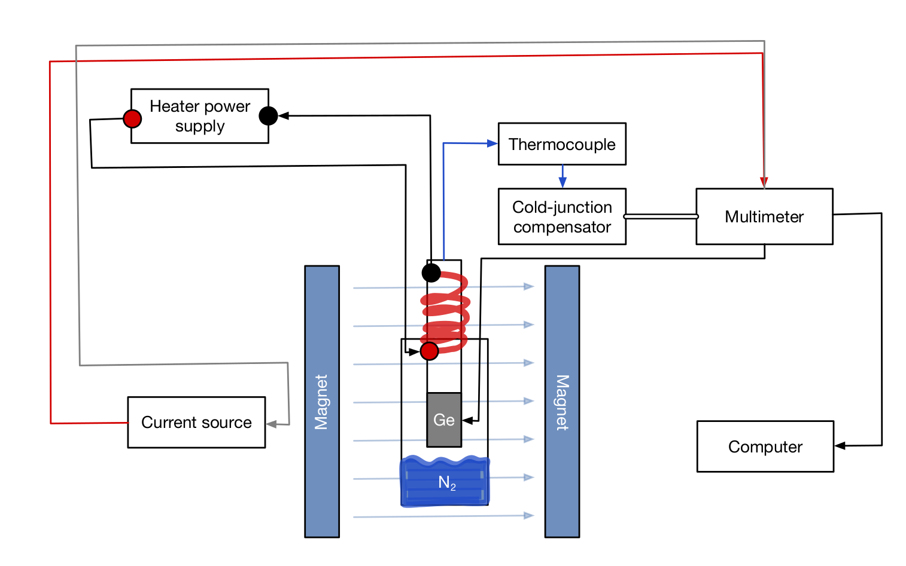
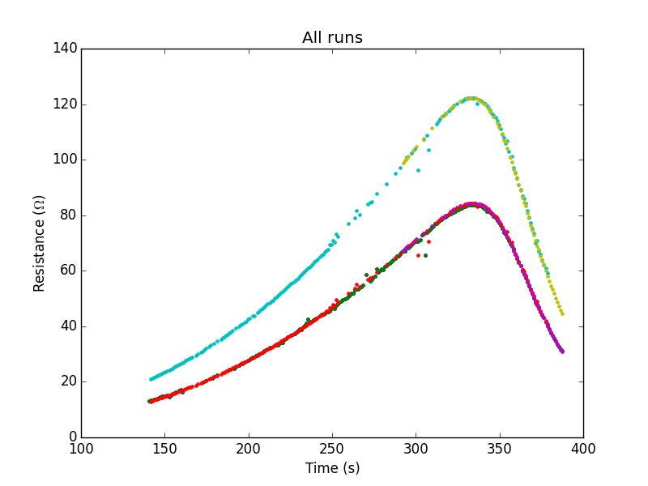

```python
import spinmob, glob, sys, subprocess
import matplotlib.pylab as plt

# Add the Programs folder to be able to import everything and do demos...
sys.path.append('../Programs/')
import simple_plot, RvsT
```

# Lab Outline

Tasks and things to do, to write, etc.

To add to it, use [Markdown](http://www.facebook.com/l.php?u=http%3A%2F%2Fmarkdowntutorial.com%2F&h=8AQGIPO_0). To write down equations, use dollar signs, and $\LaTeX$ syntax. You can use Python in code blocks.

## Goals

From the manual:
> - Measure the resistivity of germanium as a function of temperature and deduce conclusions regarding the conduction mechanism;
> - Measure the dependence of the Hall voltage across the sample on temperature;
> - Measure the magneto-resistance of the sample as a function of the magnetic field intensity;
> - **(optional)** Be creative! You may for instance study the dependence of the magneto-resistance effect on the orientation of the sample, study the heating rate of the sample, or do whatever else that may come to mind.

I propose that the optional part be spent on measuring the heating rate of the sample, as it brings together the temperature and magnetism aspect of the experiment. Still two weeks to think about, though. No worries.

## Theory behind the Hall effect (by Tuesday November 10, in the morning)

- See `References` for a nice [Youtube tutorial](https://www.facebook.com/l.php?u=https%3A%2F%2Fwww.youtube.com%2Fwatch%3Fv%3DfZoFnKo-bwk&h=8AQGIPO_0) (thanks Nico!)

I suggest that **Nico** does this since he's already gone through a review of the theory like a pro.

### What we should get

- **All** of the equations we will use later in the lab, numbered
- Clear diagrams of the physics

### Equations from the manual

Each item in the list is for what I think should be one block for an equation in the final report. If it makes it.

<small>(To remove things, use double tildes like so: ~~removed~~. To add them, just append them in the place where they'd be most useful.)</small>

1. $ R = \frac{\rho L}{S} $ where $R$ is the *electrical resistance* for a material of length *L*, cross sectional area *S* and *resistivity* $\rho$. $\rho$ is dependant on temperature for a given material.
2. $\rho = \sigma^{-1}$ and $\vec{J}=\sigma\vec{E}$, where $\sigma$ is the conductivity, $\vec{J}$ is the vectorial current density and $\vec{E}$ is the electric field. For electrons (negative charge carriers) we have $\vec{J}=e^-n\vec{v}$ where $\vec{v}$ is the mean velocity of electrons and $n$ their density in the material.
3. $\rho(T) = a\cdot T^b$ and $R = \frac{\rho L}{S}$. Because we always use the same sample, $L/S$ is constant. Hence $$ R = a'\cdot T^b,\; a'=\frac{aL}{S}.$$ We don't need to measure the resistivity, and we can have a **way** smaller uncertainty! (repeated later, in the section on resistance against temperature)

## Apparatus (by Tuesday November 10, in the morning)

### What we should get

- A list and description of the equipment **David?**
- A schematic of the experimental setup **Émile**
- A diagram of how the information is processed (not just *computer*) **Émile**
- Precisions on which steps are delicate for specific things **Émile**

### Constant Current Power Supply

* Labeled *Current source* on the diagram
* Needs to be on when we take the measurements
* Both red LEDs should be on. If the top one blinks, it means we have a faulty conection at the back
* It provides the current that flows through the germanium sample. It should be set to 1mA.
* The `OUTPUT` switch should be set to `NORM`**???**

### Variable DC Power Supply

* Provides power to the heater
* Should be used to bring the sample from around $290\mathrm{K}$ to $400\mathrm{K}$
* Make sure it is off when we leave
* The heater heats up the copper casing of the sample. For the sample to be at the same temperature, we need to heat everything slowly. So set the heater to between $5\mathrm{V}$ and $10\mathrm{V}$.

### Thermocouple System (with cold-junction compensator)

* Measures the temperature of the copper casing of the sample. Used as a proxy for the sample temperature.
* The cold-junction compensator is battery powered; make sure it is on when taking measurements.

### Magnet

### Magnetic Field Measurements with the Hall probe

### Keithley Digital Multimeter

* Takes in all the data
* Has multiple channels
* To see a specific channel manually, we can stop the `hall` program, and press the `LOCAL` and then the `SCANNER` button, before pressing the channel number you need.

### Software

See Appendix C from the manual, and the page on [Hall programs](http://www.ugrad.physics.mcgill.ca/wiki/index.php/Software:Hall_Effect) on the wiki. There's also `Manual/hall-effect-guide.pdf` by Mark that explains a lot about the software.

#### `hall` program for data acquisition

`hall` produces nine columns of data. The first 7 columns are the data from the different probes on the sample (diagram to come). The eightth column is the thermocouple voltage, and the last column is a time stamp. Using this data, we can get the potential differences between any two of the probes, as a function of time, or temperature, and get the temperature as a function of time.

#### `hall_process` program for preparing data for plotting

`hall_process` takes the data in the files produced by `hall`, and splits it into more manageable files. It's syntax is as follows:

    $ hall_process [-b bin width] input_file

`bin width` is the temperature range we want to use for each bin. The default is $1\mathrm{K}$. `input_file` is the file `hall_process` reads from. The program outputs 8 files, numbered 1 through 8, according to the voltage column they contain. They have four columns. The first one is the center of the temperature bin, the second is the average potential for the probe within the bin temperatures, the third is the statistical uncertainty from the averaging, and the fourth column is the number of measurements taken into account.

**Jack's advice**: Don't use that statistical uncertainty. Find your own. *What we can do*: take a series of measurements at room temperature to figure out the uncertainty on temperature/voltage. Then reduce the bin size to the precision of the temperature measurements ($1\mathrm{K}$), to have bins of a for single temperature measurements. Do our uncertainty analysis on that.

#### Data manipulation programs

- `hall_add`
- `hall_subtract`
- `hall_product`
- `hall_quotient`

#### Analysis software that we use

These should all be in the `Programs/` folder of the Git repository. We'll use `spinmob` as the main module for the analysis. `gnuplot` will also be used to produce plots right on the lab computer, since it doesn't have `matplotlib` installed.

### Block diagram for the magnets and stuff

See Fig. 3 from the manual. I'll reproduce it in OmniGraffle or with $\LaTeX$, and include the electronics.

I'll also produce a software diagram, so that we can easily show how we did the analysis. This can only be done at the end, though.

We'll also need a diagram like Fig. 4 from the manual for the sample holder.




### Delicate steps and things

- Do *not* exceed a *sample* temperature of $383\,\mathrm{K}$ (110°C)
- Be careful with the sample when it is very cold or close to $383\,\mathrm{K}$
- The sample and its wiring are *very* fragile
- Turn off the power sources when we leave, unless we're takign data
- Make sure cooling water is running when using the magnet
- Make sure the cold-junction compensator is switched **on** when used and **off** when unused

## ~~Measurement of the sample's relevant dimensions (by the end of Tuesday November 9's lab session)~~

### ~~What we should get~~

- A table of the sample dimensions
- Labels of the dimensions on the diagram of the sample holder

### ~~Actual measurement~~

Apparently, we will **not** be measuring the sample ourselves, instead using pictures taken by Dominic or Mark. The sample is too fragile to be manipulated by our impure hands ;P We also **don't** need the dimensions for most of the experiment. To paraphrase Dominic: the dimensions of the sample are only useful to get the resistivity, carrier density or charge. We rarely need those, so whenever we can, we should use the **resistance** instead of the resistivity, to reduce our uncertainties in the other sections of the experiment. I'll check, but this may mean that we can **completely scrap this part of the experiment**.

## ~~Resistivity~~ _Resistance_ as a function of temperature (start on Tuesday November 9)

### Methods

Turn on the current source, thermocouple, and multimeter. Cool down the sample with liquid nitrogen until the temperature stabilizes, around $140\mathrm{K}$. Make sure the nitrogen can evaporate from the thermos, otherwise the sample won't warm back up to room temperature in any reasonable time. You can do this by taking a paper towel to brush off the ice forming around the thermos. Use `hall` to check on the temperature. Once the temperature is stable, restart `hall` to get a data file with only the data we need. When the temperature reaches $250\mathrm{K}$, turn on the heater with a low potential to help bring the sample up to $400\mathrm{K}$. Raise the heater voltage if the temperature stabilizes again. Be careful to not let the sample heat up over $400\mathrm{K}$, because the soldered connections could melt. Turn off the current source, thermocouple, multimeter and heater.

### What we should get out

- A graph
- A fit, with uncertainties and chi-square 

### Not having to use the resistivity

From the manual: $\rho(T) = a\cdot T^b$ and $R = \frac{\rho L}{S}$. Because we always use the same sample, $L/S$ is constant. Hence $$ R = a'\cdot T^b,\; a'=\frac{aL}{S}.$$ We don't need to measure the resistivity, and we can have a **way** smaller uncertainty!

### Fitting the data

We should get a graph with two distinct parts; a power part, and an exponential part. We'll fit the first part using $R = a'\cdot T^b$, and verify that $b\approx3/2$, and the second part using $R=a'\exp\frac{b}{T}$ to find the band gap energy $E_g$ with Eq. 6 from the manual, $\sigma\propto\exp\frac{E_g}{2k_BT}.$ Again, because $\sigma=1/\rho$, we can use $R$ as a proxy and reduce our uncertainty since then $R^{-1}\propto\sigma$ and this does not influence $E_g$ in the parameters. 

~~We need to use $V_5$ from the data we take as the voltage drop across the crystal (confirm with Mark).~~ The potential difference across the length of the germanium sample is read both by $V_5$ and $V_6$. Both should give out the *same reading*, or very close to one another ~~**(What if they don't?)**~~. We can use a single one of them in the analysis, or both and compare the results.

$V_5$ and $V_6$ may be different because of the sample lengths, top and bottom.

The data is in `Data/Resistance vs temperature`, and info on it is in `Data/Resistance vs temperature/Readme.md`.

**Discovered here**: running the current source in `REVRS` doesn't change the gaps between $V_5$ and $V_6$, but changes the sign. To correct for this in this first data set, we'll just have to invert the signs of all the potentials. In future data collection, we'll have the `OUTPUT` of the current source set to `NORM`.


```python
reload(simple_plot)

# Test of plotting for V5 and V6
data_file1 = '../Data/Resistance against temperature/Nov12/slow_warming.5'
data_file2 = '../Data/Resistance against temperature/Nov12/slow_warming.6'
simple_plot.simple_plot(data_file1)
simple_plot.simple_plot(data_file2)
```

    
    loaded ../Data/Resistance against temperature/Nov12/slow_warming.5 
    
    
    loaded ../Data/Resistance against temperature/Nov12/slow_warming.6 
    


`slow_warming.5`


`slow_warming.6`


```python
reload(RvsT)

data_file = '../Data/Resistance against temperature/Nov12/slow_warming.5'
a, b, c, d = 150, 300, 350, 400
fits = RvsT.main(data_file, a, b, c, d)
for fit in fits:
    print fit
    print
```

    
    loaded ../Data/Resistance against temperature/Nov12/slow_warming.5 
    
    
    SETTINGS
      autoplot        True
      coarsen         [1]
      fpoints         [1000]
      plot_bg         [True]
      plot_ey         [True]
      plot_fit        [True]
      plot_guess      [True]
      plot_guess_zoom [False]
      scale_eydata    [1.0]
      style_bg        [{'color': 'k', 'marker': '', 'ls': '-'}]
      style_data      [{'color': 'b', 'marker': '+', 'ls': ''}]
      style_fit       [{'color': 'r', 'marker': '', 'ls': '-'}]
      style_guess     [{'color': '0.25', 'marker': '', 'ls': '-'}]
      subtract_bg     [False]
      xlabel          [None]
      xmax            [299.5]
      xmin            [150.5]
      xscale          ['linear']
      ylabel          [None]
      ymax            [0.070456599999999994]
      ymin            [0.014583]
      yscale          ['linear']
    
    CONSTANTS
    
    GUESS
      a          = 1
      x0         = 1
    
    FIT RESULTS (reduced chi squared = [494.84134143854101])
      a          = 0.000354334 +/- 2.14732E-07
      x0         = 117.807 +/- 0.0653573
    
    
    
    SETTINGS
      autoplot        True
      coarsen         [1]
      fpoints         [1000]
      plot_bg         [True]
      plot_ey         [True]
      plot_fit        [True]
      plot_guess      [True]
      plot_guess_zoom [False]
      scale_eydata    [1.0]
      style_bg        [{'color': 'k', 'marker': '', 'ls': '-'}]
      style_data      [{'color': 'b', 'marker': '+', 'ls': ''}]
      style_fit       [{'color': 'r', 'marker': '', 'ls': '-'}]
      style_guess     [{'color': '0.25', 'marker': '', 'ls': '-'}]
      subtract_bg     [False]
      xlabel          [None]
      xmax            [387.5]
      xmin            [350.5]
      xscale          ['linear']
      ylabel          [None]
      ymax            [0.076527700000000004]
      ymin            [0.031310999999999999]
      yscale          ['linear']
    
    CONSTANTS
    
    GUESS
      a          = 1
      b          = 1
      x0         = 0
    
    FIT RESULTS (reduced chi squared = [2.3457694011822346e+19])
      a          = 4.10462E-122 +/- 1.04425E-124
      b          = 1 +/- 1.46431E-18
      x0         = 93.2136 +/- 2.91038E-11
    
    


```python
reload(RvsT)

data_file = '../Data/Resistance against temperature/Nov12/slow_warming.6'
a, b, c, d = 150, 300, 350, 400
fits = RvsT.main(data_file, a, b, c, d)
for fit in fits:
    print fit
    print
```

    
    loaded ../Data/Resistance against temperature/Nov12/slow_warming.6 
    
    
    SETTINGS
      autoplot        True
      coarsen         [1]
      fpoints         [1000]
      plot_bg         [True]
      plot_ey         [True]
      plot_fit        [True]
      plot_guess      [True]
      plot_guess_zoom [False]
      scale_eydata    [1.0]
      style_bg        [{'color': 'k', 'marker': '', 'ls': '-'}]
      style_data      [{'color': 'b', 'marker': '+', 'ls': ''}]
      style_fit       [{'color': 'r', 'marker': '', 'ls': '-'}]
      style_guess     [{'color': '0.25', 'marker': '', 'ls': '-'}]
      subtract_bg     [False]
      xlabel          [None]
      xmax            [299.5]
      xmin            [150.5]
      xscale          ['linear']
      ylabel          [None]
      ymax            [0.103391]
      ymin            [0.023060000000000001]
      yscale          ['linear']
    
    CONSTANTS
    
    GUESS
      a          = 1
      x0         = 1
    
    FIT RESULTS (reduced chi squared = [471.11037874648383])
      a          = 0.00050845 +/- 3.02284E-07
      x0         = 112.955 +/- 0.0687961
    
    
    
    SETTINGS
      autoplot        True
      coarsen         [1]
      fpoints         [1000]
      plot_bg         [True]
      plot_ey         [True]
      plot_fit        [True]
      plot_guess      [True]
      plot_guess_zoom [False]
      scale_eydata    [1.0]
      style_bg        [{'color': 'k', 'marker': '', 'ls': '-'}]
      style_data      [{'color': 'b', 'marker': '+', 'ls': ''}]
      style_fit       [{'color': 'r', 'marker': '', 'ls': '-'}]
      style_guess     [{'color': '0.25', 'marker': '', 'ls': '-'}]
      subtract_bg     [False]
      xlabel          [None]
      xmax            [387.5]
      xmin            [350.5]
      xscale          ['linear']
      ylabel          [None]
      ymax            [0.11088000000000001]
      ymin            [0.045414999999999997]
      yscale          ['linear']
    
    CONSTANTS
    
    GUESS
      a          = 1
      b          = 1
      x0         = 0
    
    FIT DID NOT CONVERGE
      a          = -4.52934E-75 (meaningless)
      b          = 1 (meaningless)
      x0         = 115.285 (meaningless)
    
    


## Hall coefficient as a function of temperature (start on Thursday November 11, use for interim report)

### What we should get out

- A graph
- A fit, with uncertainties and chi-square

## Interim report (due Tuesday November 19)

We need to have:

- A function of the resistance against temperature
- ~~A function for the Hall coefficient against temperature~~
- An explanation of how we managed our uncertainties

Ideally, *all* of the interim report can be used for the final report.

## Magneto-resistance against magnetic field intensity (start Thursday November 21)

### What we should get out

- A graph
- A fit with uncertainties and chi-square


```python

```
